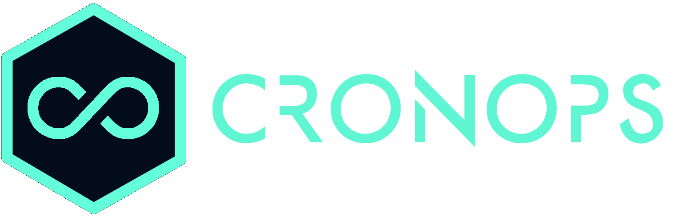

<div align="left">
    
</div>

# CronOps DevOpsTips 

## Overview
This repository contains all files used to create [CronOps DevOpsTips](https://devopstips.cronops.io)

### Branches
- `master`   --> contains the source code
- `gh-pages` --> deployable (builded) version

## Deployed Documentation
Check it out [here](https://devopstips.cronops.io/).

## Development / Contributing

1. Clone the repo locally
2. Config your MkDocs env including the navigation tree directory via `mkdocs.yml` file.
3. Spin up your MkDocs local dev web server environment (`http://localhost:8000`) (real time updates we'll be shown) via `Makefile` cmd
```bash
 make docs-live          
```
4. Update necessary `*.md` files inside the `docs/` folder and check your updates through the browser
```bash
make docs-deploy-gh
``` 
5. And create your PR from `BBL-XXX` to `master` branch.
6. The Github Pages site [https://devopstips.cronops.io](https://devopstips.cronops.io/) will be automatically deployed 
via CircleCI job to the `gh-pages` branch (currently being built from this branch).

### TODO
1. Several sections needs completion or update. 
2. Add figures caption cross doc.


