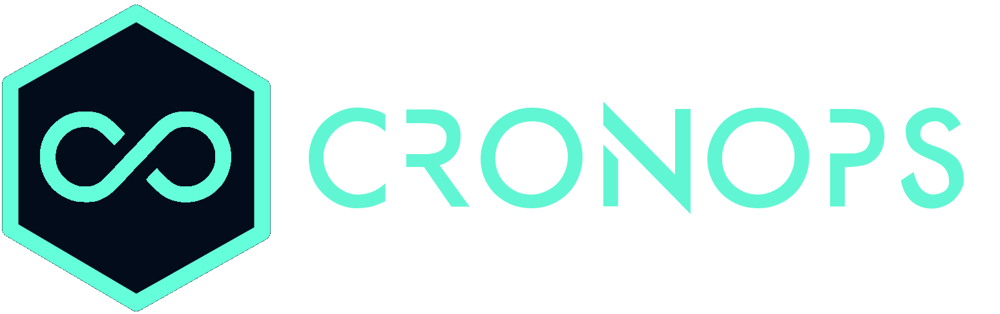

{: style="width:250px"}

# Welcome

!!! abstract "Overview"
    **CronOps DevOpsTips** show Product Management, Development, QA, IT Operations, and Information Security
    best practices and how they all integrate to contribute in both building and scaling high-performance
    technology organizations. The result of following our tips and shifting to a DevOps mindset and culture
    should be a world-class software delivery performance through optimized collaboration, communication,
    reliability, stability, scalability and security at ever lower cost and effort.

## Getting Started

!!! tip "DevOpsTips Categories" 
    Discover our tips classified by DevOps Improvement capabilities categories directly associated to software delivery
    performance.

    :books: See [**Culture**](culture/index.md) 
    
    :books: See [**Product and Process**](product-and-process/index.md)
    
    :books: See [**Lean Management**](lean-management/index.md)
    
    :books: See [**Architecture**](architecture/index.md)
    
    :books: See [**Development & CI/CD**](continuous-delivery/index.md)
    
    :books: See [**Monitoring & SRE**](monitoring-and-sre/index.md)
    
    :books: See [**Security**](security/index.md)

---
### :art: Color Settings

The color scheme will be set based on user preference, which makes use of the `prefers-color-scheme` media query. 

!!! info "How to setup Dark mode | Dark theme"
    * [x] [Google Chrome | Browse in Dark mode or Dark theme](https://support.google.com/chrome/answer/9275525)
    * [x] [How to enable dark mode on your phone, laptop, and more](https://www.theverge.com/2019/3/22/18270975/how-to-dark-mode-iphone-android-mac-windows-xbox-ps4-nintendo-switch)

#### :art: Try it yourself
:material-cursor-default-click-outline: Click on below presented buttons to change the color
scheme

  <button data-md-color-scheme="default"><code>default-theme | day-mode</code></button>
   
  <button data-md-color-scheme="slate"><code>dark-theme &nbsp&nbsp | night-mode</code></button>

